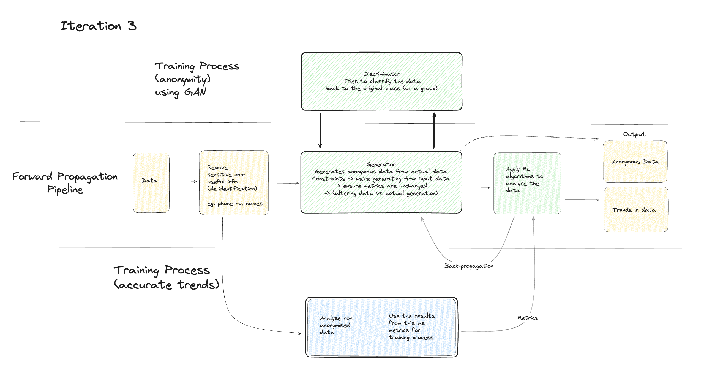

This indicates that the entire training process, including both the Generator and Discriminator, can be repeated multiple times to progressively improve the model's ability to both generate anonymous data and distinguish between real and fake data.
Training Needs

Training Needs (Iteration 3): 
This section highlights the key aspects that need to be addressed during this particular iteration of the training process. It mentions:
o	Training data: This refers to the data used to train the model.
o	Metrics: These are the measurements used to evaluate the model's performance, such as accuracy, precision, recall, and F1 score for the Discriminator, or the level of anonymity and data utility for the Anonymity Pipeline.
o	Model architecture: This refers to the structure and design of the Generator and Discriminator models.
Overall, the diagram showcases a training process for a GAN model that prioritizes data privacy. It emphasizes the iterative nature of the training, where both the Generator and Anonymity Pipeline are continuously refined to achieve a balance between generating realistic data and protecting sensitive information.

### Check out our thought process that led us here!
